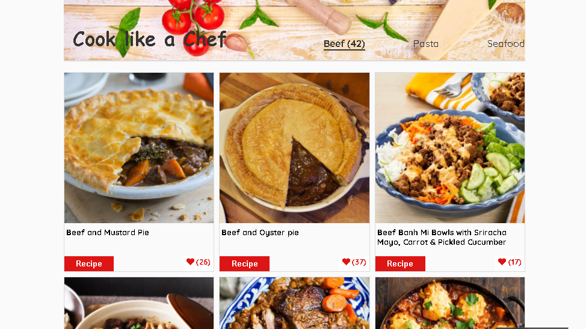
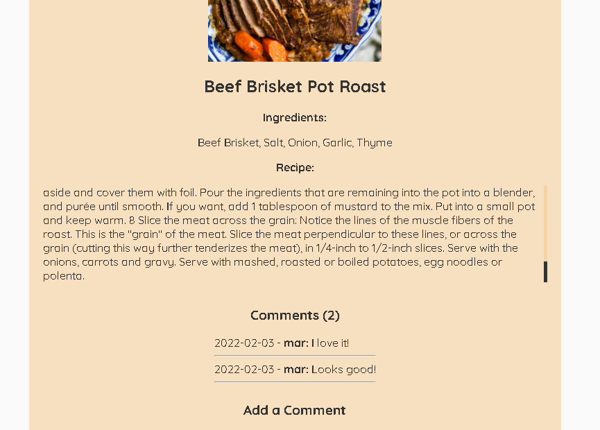

Capstone Group Project JavaScript


# Capstone Project JavaScript

> Capstone JavaScript using HTML, CSS, Jest, JavaScripts, GitFlow and Webpack




## Live Demo

[Live Demo Link](https://hendridg.github.io/capstone-javascript/)

## Built With

- HTML 
- CSS 
- JavaScripts
- Webpack

## Getting Started

- Run this command in your OS terminal to get a copy of the project:

  ```
  git@github.com:hendridg/capstone-javascript.git
  ```

- Open the folder project from your code editor.

- Run:

  ```
  npm install
  ```
  
- From the root folder run start command to see the project on browser: 

  ```
  npm start
  ```


### Prerequisites

- GIT

### Setup

* Clone the repository in order to get a copy of this project

Open a terminal or a git bash in the desired directory and run `https://github.com/hendridg/capstone-javascript.git`

## Authors

👤 **Hendrid Gonzalez**

- GitHub: [@hendridg](https://github.com/hendridg)
- Twitter: [@hendridg](https://twitter.com/hendridg)
- LinkedIn: [LinkedIn](https://linkedin.com/in/hendridg)

👤 **Mar Bautista**

- GitHub: [@marilirulita](https://github.com/marilirulita)
- Twitter: [@marylirulita](https://twitter.com/marylirulita)
- LinkedIn: [mar-bautista](https://www.linkedin.com/in/marbautista/)


## 🤝 Contributing

Contributions, issues, and feature requests are welcome!

Feel free to check the [issues page](https://github.com/hendridg/capstone-javascript/issues).

## Show your support

Give a ⭐️ if you like this project!
